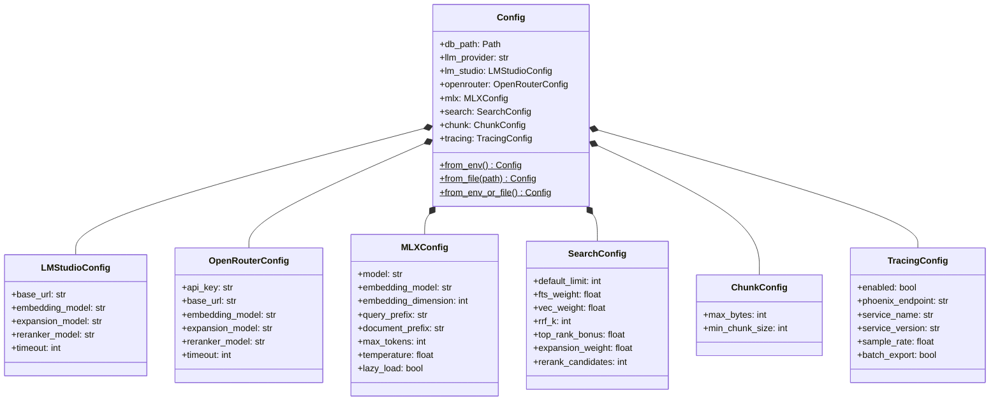

# PMD Library Class Diagrams

This document provides class diagrams for each module in the PMD library, showing class structures, inheritance hierarchies, and inter-module relationships.

## Module Overview

The PMD library consists of the following modules (excluding CLI and MCP):

| Module | Purpose | Key Classes |
|--------|---------|-------------|
| **core** | Types, configuration, exceptions | Config, Collection, SearchResult, RankedResult |
| **llm** | LLM provider abstraction | LLMProvider, EmbeddingGenerator, QueryExpander, DocumentReranker |
| **search** | Search pipeline and algorithms | HybridSearchPipeline, SearchPipelineConfig |
| **services** | Business logic orchestration | ServiceContainer, IndexingService, SearchService, StatusService |
| **sources** | Document source abstraction | DocumentSource, FileSystemSource, HTTPSource, EntitySource |
| **store** | Data access layer | Database, *Repository classes |
| **utils** | Utility functions | (No classes - only functions) |

---

## Core

The core module provides foundational types, configuration, and exceptions. It has **zero dependencies** on other PMD modules.

### Exception Hierarchy


### Configuration Classes



### Data Types


### Cross-Module Interactions


---

## LLM

The LLM module provides an abstraction layer for multiple LLM providers with support for embeddings, text generation, and document reranking.

### Provider Hierarchy


### Service Classes


### Cross-Module Interactions


---

## Search

The search module implements the hybrid search pipeline combining full-text search (FTS5) and vector search with RRF fusion and LLM reranking.

### Class Diagram


### Pipeline Functions


### Cross-Module Interactions


---

## Services

The services module provides business logic orchestration using a dependency injection container pattern.

### Service Container


### Data Classes


### Cross-Module Interactions


---

## Sources

The sources module provides a document source abstraction supporting filesystem, HTTP, and custom entity resolvers.

### Protocol and Implementations


### Configuration Classes


### Credential Providers


### Entity Resolver System


### Registry Pattern


### Exception Hierarchy


### Cross-Module Interactions


---

## Store

The store module provides the data access layer using SQLite with content-addressable storage and optional vector search.

### Repository Pattern

```mermaid
classDiagram
    direction TB

    Database <-- CollectionRepository : uses
    Database <-- DocumentRepository : uses
    Database <-- EmbeddingRepository : uses
    Database <-- FTS5SearchRepository : uses
    Database <-- SourceMetadataRepository : uses

    SearchRepository~T~ <|-- FTS5SearchRepository
    SearchRepository~T~ <|-- VectorSearchRepository
    VectorSearchRepository --> EmbeddingRepository : uses

    class Database {
        -conn: aiosqlite.Connection
        -path: Path
        +vec_available: bool
        +connect() None
        +close() None
        +transaction() AsyncContextManager
        +execute(sql, params) Cursor
        +executescript(sql) None
    }

    class SearchRepository~T~ {
        <<abstract>>
        +search(query, collection_id, limit)* list~SearchResult~
    }

    class CollectionRepository {
        -db: Database
        +list_all() list~Collection~
        +get_by_name(name) Collection
        +get_by_id(id) Collection
        +create(name, pwd, pattern, source_type, config) Collection
        +remove(name) None
        +rename(old_name, new_name) None
        +update_collection_path(id, pwd) None
    }

    class DocumentRepository {
        -db: Database
        +add_or_update(coll_id, path, title, body, context) DocumentResult
        +get(coll_id, path) DocumentResult
        +get_by_hash(hash) DocumentResult
        +list_by_collection(coll_id) list~DocumentResult~
        +delete(coll_id, path) None
        +check_if_modified(coll_id, path, hash) bool
        +get_content_length(hash) int
        +count_by_collection(coll_id) int
    }

    class EmbeddingRepository {
        -db: Database
        +store_embedding(hash, pos, embedding, model) None
        +get_embeddings_for_content(hash) list~list~float~~
        +has_embeddings(hash, model) bool
        +delete_embeddings(hash) None
        +clear_embeddings_by_model(model) int
        +count_embeddings() int
        +search_vectors(embedding, coll_id, limit) list~SearchResult~
    }

    class FTS5SearchRepository {
        -db: Database
        +search(query, coll_id, limit) list~SearchResult~
        +index_document(coll_id, path, title, body) None
        +reindex_collection(coll_id) None
        +remove_from_index(coll_id, path) None
        +clear_index() None
    }

    class VectorSearchRepository {
        -embedding_repo: EmbeddingRepository
        +search(embedding, coll_id, limit) list~SearchResult~
    }

    class SourceMetadataRepository {
        -db: Database
        +upsert(doc_id, metadata) None
        +get_by_document(doc_id) SourceMetadata
        +get_by_uri(uri) SourceMetadata
        +delete_by_document(doc_id) None
        +needs_refresh(doc_id, current_etag) bool
        +get_stale_documents(coll_id) list~int~
        +cleanup_orphans() int
    }
```

### Data Classes

```mermaid
classDiagram
    class SourceMetadata {
        +document_id: int
        +source_uri: str
        +etag: str
        +last_modified: datetime
        +content_type: str
        +fetch_timestamp: datetime
    }
```

### Cross-Module Interactions

```mermaid
flowchart LR
    subgraph store[Store Module]
        Database
        CollectionRepository
        DocumentRepository
        EmbeddingRepository
        FTS5SearchRepository
        VectorSearchRepository
        SourceMetadataRepository
    end

    subgraph core[Core]
        Collection
        DocumentResult
        SearchResult
        Exceptions[DatabaseError, DocumentNotFoundError, CollectionErrors]
    end

    subgraph utils[Utils]
        sha256_hash
    end

    store --> Collection
    store --> DocumentResult
    store --> SearchResult
    store --> Exceptions
    DocumentRepository --> sha256_hash

    services[Services] --> store
    llm[LLM] --> EmbeddingRepository
    search[Search] --> FTS5SearchRepository
```

---

## Utils

The utils module contains utility functions with no classes. It serves as a shared utility layer.

### Functions

```mermaid
flowchart TB
    subgraph utils[Utils Module]
        hashing[hashing.py]
    end

    hashing --> sha256_hash["sha256_hash(content: str) -> str"]
    hashing --> sha256_hash_bytes["sha256_hash_bytes(content: bytes) -> str"]

    subgraph consumers[Consumers]
        store_docs[store.documents.DocumentRepository]
        services_idx[services.indexing.IndexingService]
    end

    store_docs --> sha256_hash
    services_idx --> sha256_hash
```

---

## Module Dependency Graph

This diagram shows the overall dependency relationships between all modules:

```mermaid
flowchart TB
    subgraph foundation[Foundation Layer]
        core[Core]
        utils[Utils]
    end

    subgraph data[Data Layer]
        store[Store]
    end

    subgraph integration[Integration Layer]
        sources[Sources]
        llm[LLM]
    end

    subgraph processing[Processing Layer]
        search[Search]
    end

    subgraph orchestration[Orchestration Layer]
        services[Services]
    end

    %% Foundation dependencies
    store --> core
    store --> utils

    sources --> core

    llm --> core
    llm --> store
    llm --> search

    search --> core
    search --> store

    services --> core
    services --> store
    services --> llm
    services --> search
    services --> sources
    services --> utils
```

### Dependency Matrix

| Module | core | utils | store | llm | search | sources | services |
|--------|:----:|:-----:|:-----:|:---:|:------:|:-------:|:--------:|
| **core** | - | - | - | - | - | - | - |
| **utils** | - | - | - | - | - | - | - |
| **store** | Y | Y | - | - | - | - | - |
| **llm** | Y | - | Y | - | Y | - | - |
| **search** | Y | - | Y | Y* | - | - | - |
| **sources** | Y | - | - | - | - | - | - |
| **services** | Y | Y | Y | Y | Y | Y | - |

*Y = Direct dependency, Y* = TYPE_CHECKING only (optional runtime dependency)
