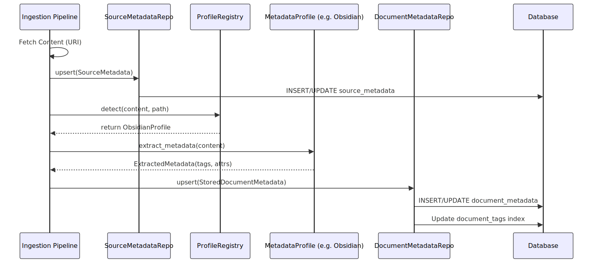

# Metadata Architecture

This document explains the relationship between **Source Metadata**, **Document Metadata**, and **Metadata Profiles** in the PMD system.

## Overview

The system separates metadata into two distinct layers:
1. **Source Metadata**: Information about the *origin* and *transport* of the document (e.g., HTTP headers, file paths, fetch timestamps).
2. **Document Metadata**: Information extracted *from the content* of the document (e.g., tags, frontmatter attributes, title).

**Metadata Profiles** serve as the bridge between raw content and structured Document Metadata, providing logic to parse specific formats (like Obsidian or Drafts) into a standardized structure.

## Unified Metadata Package

All metadata functionality is consolidated in the `pmd.metadata` package with clear submodules:

```
pmd/metadata/
├── __init__.py          # Public API surface (re-exports from submodules)
├── model/               # Core types and ontology
│   ├── types.py         # ExtractedMetadata, StoredDocumentMetadata, MetadataProfile
│   ├── ontology.py      # Ontology, OntologyNode - tag hierarchy
│   ├── aliases.py       # TagAliases - alias resolution
│   └── data/            # JSON data files (ontology, aliases)
├── extraction/          # Source-aware metadata extraction
│   ├── generic.py       # GenericProfile - fallback
│   ├── obsidian.py      # ObsidianProfile - Obsidian vault support
│   ├── drafts.py        # DraftsProfile - Drafts app support
│   ├── registry.py      # MetadataProfileRegistry with auto-detection
│   └── parsing.py       # Frontmatter and inline tag parsing
├── query/               # Query-time operations
│   ├── inference.py     # LexicalTagMatcher - tag inference from queries
│   ├── retrieval.py     # TagRetriever - tag-based document retrieval
│   └── scoring.py       # Score boosting based on tag matches
└── store/               # Persistence
    └── repository.py    # DocumentMetadataRepository
```

### Import Patterns

```python
# Recommended: Import from top-level pmd.metadata
from pmd.metadata import (
    Ontology, TagAliases, ExtractedMetadata,
    GenericProfile, get_default_profile_registry,
    LexicalTagMatcher, create_default_matcher,
    DocumentMetadataRepository,
)

# Alternative: Import from specific subpackages
from pmd.metadata.extraction import ObsidianProfile
from pmd.metadata.query import TagRetriever
from pmd.metadata.store import DocumentMetadataRepository
```

### Deprecated Import Paths

The following import paths are deprecated and will be removed in a future version:
- `pmd.sources.metadata` → use `pmd.metadata` or `pmd.metadata.extraction`
- `pmd.search.metadata` → use `pmd.metadata` or `pmd.metadata.query`
- `pmd.store.document_metadata` → use `pmd.metadata` or `pmd.metadata.store`

## 1. Source Metadata (The "Envelope")

Managed by `SourceMetadataRepository` (`src/pmd/store/source_metadata.py`).

This layer tracks **where** a document came from and **when** it was retrieved. It is primarily used for:
- **Change Detection**: Using ETags or Last-Modified dates to skip processing unchanged documents.
- **Provenance**: Knowing the original URI or file path.
- **Diagnostics**: Tracking fetch duration and HTTP status codes.

**Key Attributes:**
- `source_uri`: The unique identifier of the source.
- `etag` / `last_modified`: For cache validation.
- `last_fetched_at`: Timestamp of the last sync.

## 2. Document Metadata (The "Content")

Managed by `DocumentMetadataRepository` (`src/pmd/metadata/store/repository.py`).

This layer tracks **what** the document is about. It is populated by parsing the document content. It is primarily used for:
- **Search**: Filtering documents by tags or attributes.
- **Organization**: Grouping documents by author, date, or category.

**Key Attributes:**
- `tags`: A normalized set of tags (e.g., `["project", "project/active"]`).
- `attributes`: Key-value pairs extracted from frontmatter (e.g., `{"title": "My Note", "priority": "high"}`).
- `profile_name`: The name of the profile used to extract this data.

## 3. Metadata Profiles (The "Translator")

Managed by `MetadataProfileRegistry` (`src/pmd/metadata/extraction/registry.py`).

A **Metadata Profile** is a strategy pattern implementation that knows how to extract meaning from a specific document format. Different apps (Obsidian, Drafts, standard Markdown) store metadata differently.

**Responsibilities:**
- **Detection**: Determining if a file belongs to this profile (via path patterns or content heuristics).
- **Extraction**: Parsing the content to find tags and attributes.
- **Normalization**: Converting app-specific tag formats (e.g., `#parent/child`) into a standard format.

---

## System Components

The following diagram illustrates how the repositories and registry interact with the database tables.



## Ingestion Workflow

The following sequence diagram shows how a document flows through the system during an update.

1. The system fetches the document from the source.
2. **Source Metadata** is updated immediately to record the fetch.
3. The **Registry** analyzes the file to pick the right **Profile**.
4. The **Profile** extracts tags and attributes from the content.
5. **Document Metadata** is updated with the extracted information.



## Relationship with Collections

Collections act as the top-level container for documents. While metadata is attached to individual documents, the Collection defines the scope and source of those documents.

1.  **Scope**: A Collection groups related documents (e.g., "Personal Notes", "Work Docs").
2.  **Source Configuration**: The Collection defines *how* to fetch documents (e.g., from a local folder or an API). This influences the initial `SourceMetadata`.
3.  **Profile Context**: While profiles are currently detected per-document, the Collection's path or source type often implicitly determines the likely profile (e.g., a Collection pointing to an Obsidian vault will predominantly use the Obsidian profile).

The hierarchy is strictly: **Collection -> Document -> Metadata**.



## Impact of Collection Source Type

The `source_type` of a Collection determines the strategy used to provision **Source Metadata** and detect changes. This is implemented via the `DocumentSource` strategy pattern.

### 1. Filesystem Source (`source_type="filesystem"`)
-   **Provisioning**: Uses file system statistics (`stat()`).
-   **Change Detection**: Compares `mtime` (modification time) and file size.
-   **Metadata Populated**:
    -   `last_modified`: Maps to file `mtime`.
    -   `extra_metadata`: Contains `size`, `mtime_ns`.





