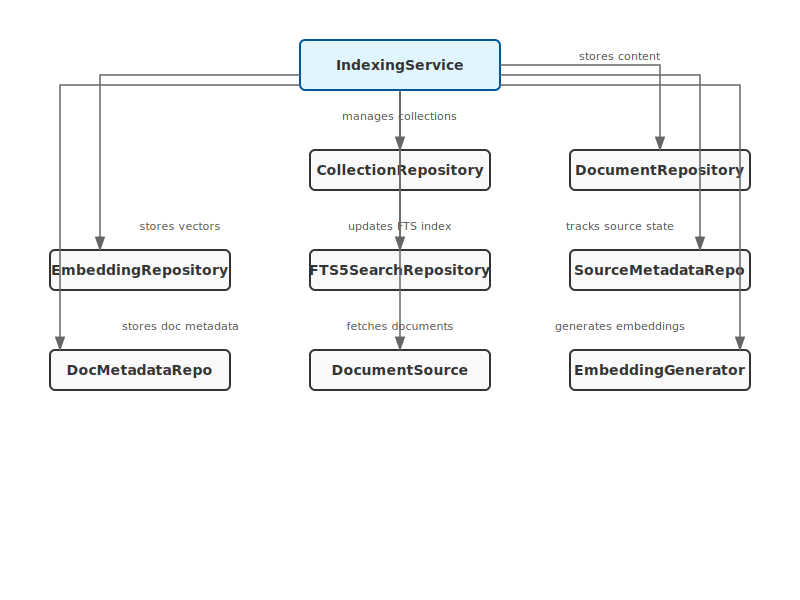
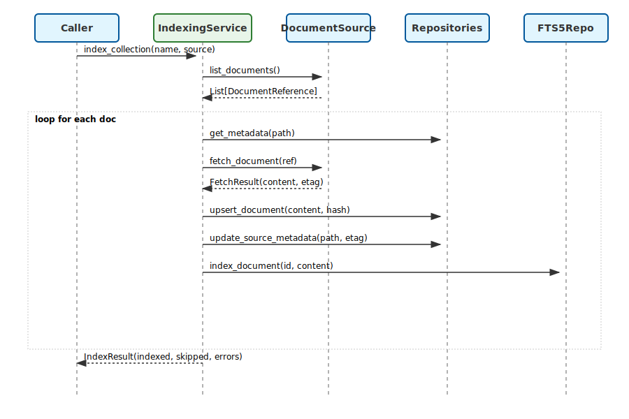
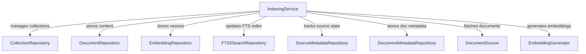
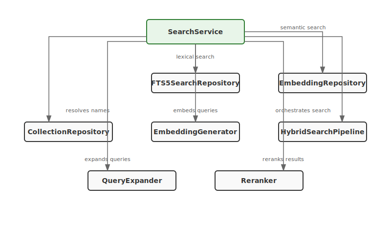
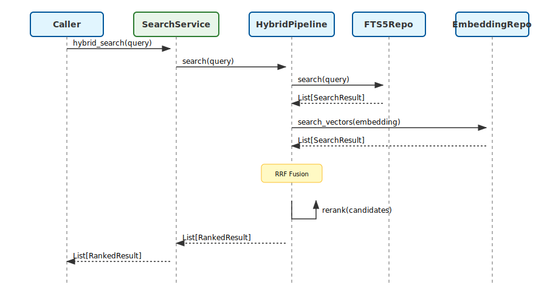
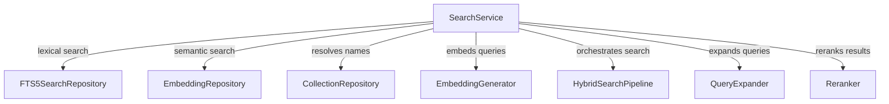
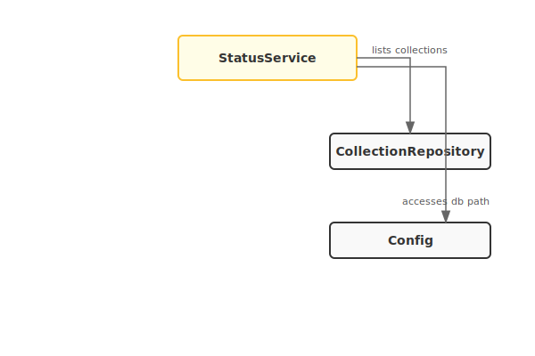
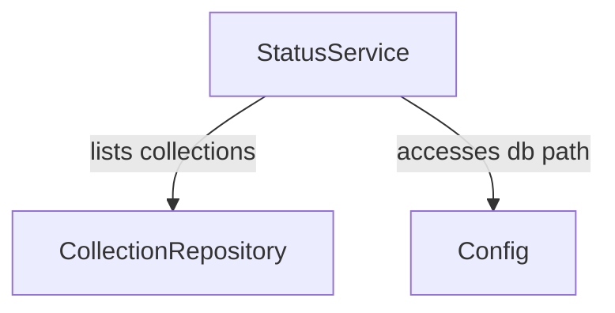

# Services Module Architecture

**Location:** `src/pmd/services/`

Business logic orchestration layer coordinating repositories and LLM components.

## Files and Key Abstractions

### `container.py`

**`ServiceContainer`** - Dependency injection container

Responsibilities:
- Repository lifecycle management
- LLM component lazy initialization
- Service accessor properties
- Resource cleanup via async context manager

Key properties:
- `collection_repo`, `document_repo`, `embedding_repo`, `fts_repo`
- `indexing`, `search`, `status` (service accessors)

Key methods:
- `get_llm_provider()` - Async factory for LLM
- `get_embedding_generator()` - Async factory for embeddings
- `vec_available` - Check sqlite-vec availability
- `is_llm_available()` - Async LLM health check

### `indexing.py`

**`IndexingService`** - Document indexing and embedding

#### Component Architecture

#### Sequence Diagram

**`IndexResult`** - Indexing operation result
- indexed, skipped, errors fields

**`EmbedResult`** - Embedding operation result
- embedded, skipped, chunks_total fields

**`CleanupResult`** - Cleanup operation result
- orphaned_content, orphaned_embeddings fields

Key methods:
- `index_collection()` - Enumerate, fetch, store, index documents (requires DocumentSource)
- `embed_collection()` - Generate embeddings for indexed docs
- `update_all_collections()` - Batch update all collections
- `cleanup_orphans()` - Remove orphaned content and embeddings

**Invariants:**
- Indexing continues on individual document errors
- Source metadata (ETags) enables incremental updates
- Content hash comparison for change detection

### `search.py`

**`SearchService`** - Search operation orchestration

#### Component Architecture

#### Sequence Diagram

Key methods:
- `fts_search()` - Synchronous BM25 search
- `vector_search()` - Async semantic search
- `hybrid_search()` - Combined FTS + vector with optional LLM

**Invariants:**
- Vector search requires sqlite-vec and LLM provider
- Hybrid search delegates to HybridSearchPipeline

### `status.py`

**`StatusService`** - Index health monitoring

#### Component Architecture

Key methods:
- `get_index_status()` - Quick status summary
- `get_full_status()` - Comprehensive async status
- `get_collection_stats()` - Per-collection statistics
- `get_index_sync_report()` - FTS/vector sync status
